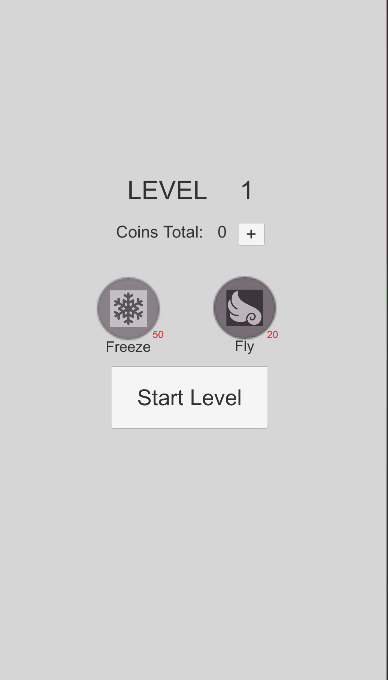

Migrated from CDM's Gitlab Server. 

# Clouds Awakening Trouble: Rickety Risks and Magic Tricks

A collaborative project with fellow Centre for Digital Media C14 Cohort Members: Jeanette (UX/UI Designer), Maple (Project Manger), Andre (2D/3D Artist), Alessandra(UX/UI Designer), and myself Irene (Programmer/Game Designer). 

A mobile 2D game with stacking and balancing mechanics. As per the challenge design, it also incoporates a proof of concept reward/buff system. Aside from implementing iterative game design development, it makes usage of ScriptableDataObjects for scalable code. 

# Game Trailer
[Link](https://drive.google.com/file/d/1F2gfjDtfxiiS063af1vA2N0yC83iCl-C/view?usp=sharing)

# Gameplay Screenshots 

